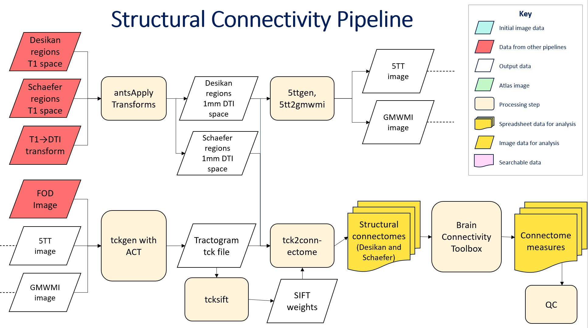

.. SCP-Documentation documentation master file, created by
   sphinx-quickstart on Fri Feb 14 12:23:59 2025.
   You can adapt this file completely to your liking, but it should at least
   contain the root `toctree` directive.

Welcome to the Structural-Connectivity Pipeline Documentation
=============================================

This documentation provides an overview of the Structural-Connectivity Pipeline and detailed instructions on how to run and use the pipeline effectively. Below are some key references and methodologies used in the pipeline.

Index
==================

* :doc:`Installation`
* :doc:`RunningSCP`
* :doc:`UsageNotes`
* :doc:`PerformanceBenchmarks`
* :doc:`Citations`
* :ref:`search`
